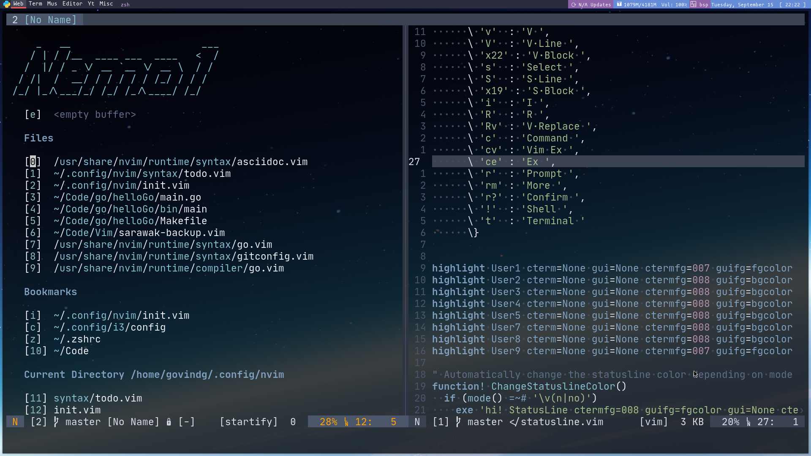

# Nvim Nemo 1



A modular neovim configuration with sane, but flexible defaults.

### Install the entire configuration with 

```bash 
bash <(curl -s https://raw.githubusercontent.com/sandkoan/nvim/master/bin/install.sh)
```

**Note: This installation script only works on Ubuntu/Debian and Manjaro/Arch.**

If you already have an nvim configuration in ```~/.config/nvim```, the ```nvim``` folder will be renamed to ```nvim_old```.

### Some of the installed plugins
* Plugin manager is [vim-plug](https://github.com/junegunn/vim-plug)
* [Ranger](https://github.com/ranger/ranger) for file exploring with highly customizable vim keybindings
* Tim Pope's [vim-fugitive](https://github.com/tpope/vim-fugitive) for git integration and [vim-surround](https://github.com/tpope/vim-surround) for surrounding things
* [Vim-which-key](https://github.com/liuchengxu/vim-which-key) for Spacemacs-style leader popup 

### Location
* User-specific configuration can be found in [nemo](https://github.com/sandkoan/nvim/tree/master/nemo)
* Configuration settings for installed plugins can be found in [plug-config](https://github.com/sandkoan/nvim/tree/master/nemo/plug-config)
    * For example, to change file/directory shortcuts in startify, edit ```plug-config/startify.vim```
* I strongly recommend that you install a patched font, like the [JetBrainsMono Nerd Font](https://github.com/ryanoasis/nerd-fonts/tree/master/patched-fonts/JetBrainsMono).
